# 写在前面的话

网上的教程都太简单了（代码又太难了），我摸索了好一阵。所以这是一个特别啰嗦的教程，每一步都有截图。

整个流程：

- 确保你的库都全了
- 用账号密码登入网页
- 取读炼句信息
- 清洗数据
- 保存数据到Excel
- 附完整代码

代码运行界面：

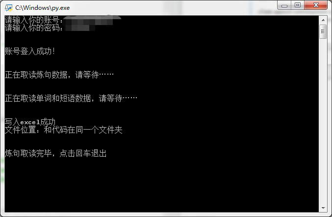

# 老规矩：安装库

```python
import requests
import json
import re
import xlwt
```

确认一下，你有没有`requests`和`xlwt`的库，没有的话，装一下

如果不装，代码运行不起来，你双击`.py`文件，就直接闪退了

如果你在调试中运行，那会报错

安装`requests`的界面如下：

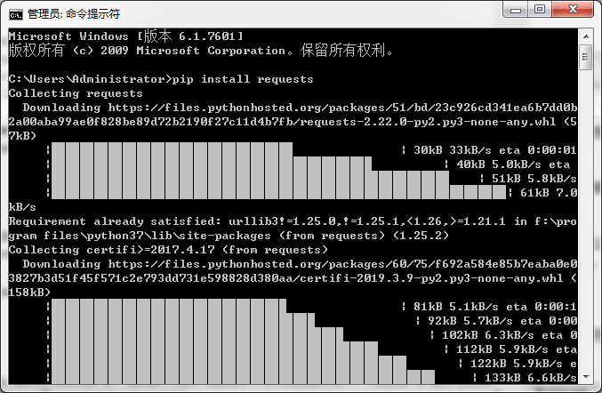

# 账号密码登入

基本步骤：

（1）获取网址，得到【URL】

（2）输入账号密码，得到【data】

（3）构建Request Headers，得到【headers】

（4）登入网页

## （1）URL

首先，网页类型分为两种，静态和动态的

| 静态页面                                    | 动态页面                       |
| ------------------------------------------- | ------------------------------ |
| 非结构化数据：HTML                          | 结构化数据：json，xml等        |
| 处理方式：正则表达式，xpath, beautifulsoup4 | 处理方式：直接转化为python类型 |

以扇贝网为例，浏览器为360极速浏览器

网址：<https://web.shanbay.com/web/account/login>

扇贝网里面，部分网页是静态的，部分是动态的


右击“审查元素”，或者F12，打开开发人员工具

点击“Network”，把`Preserve Log`勾选上，在左下角那个框里输入“login”（表示只看登入信息）

输入账号密码，登入网页


登入后，显示如下


在这里可以看到，其实我们实际登入的网址是https://apiv3.shanbay.com/bayuser/login，请求方式是`POST`


补充，请求方式Request Method一般有两种，GET和POST

- GET： 请求的URL会附带查询参数
- POST： 请求的URL不会附带查询参数

所以第一步，明确，我们是POST请求，网址是https://apiv3.shanbay.com/bayuser/login

```python
postUrl = 'https://apiv3.shanbay.com/bayuser/login'
```

## （2）包含账号密码的data

刚刚那个界面，往下滑到最后

我们看到，请求是`Request Payload`，里面包含了我们账号密码的信息


还有一种方式是`Form Data`，具体区别可参考 [HTTP请求中的form data和request payload的区别](https://www.cnblogs.com/btgyoyo/p/6141480.html)

我们这里就讲`Request Payload`，现在扇贝用这个

```python
PayloadData  = {
                 'account': "1********9",
                 'code_2fa': "",
                 'password': "Z*************6"       
                }
```

## (3)headers

还是刚刚那个界面，网上翻一点，就能看到`Request Header`，我们选取其中部分信息，构造一个头

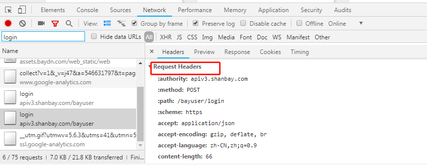

我们选这3个数据，自己假装构建一个`Request Header`

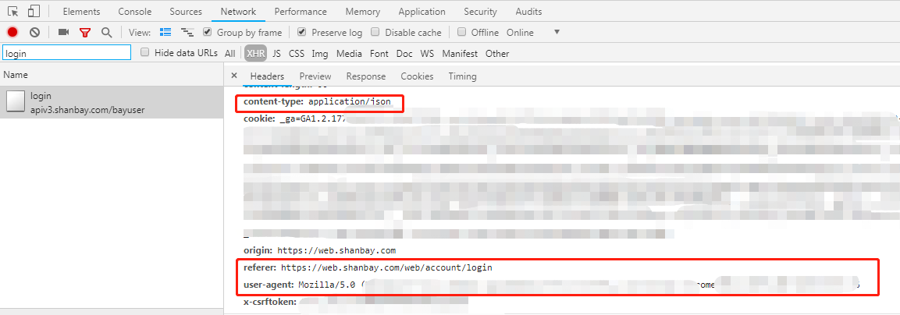

```python
payloadHeader = {'user-agent':'Mozilla/5.0 (Windows NT 6.1; WOW64) AppleWebKit/537.36 (KHTML, like Gecko) Chrome/69.0.3497.100 Safari/537.36',
                 'referer': "https://web.shanbay.com/web/account/login/",
                 'content-type': 'application/json'
                 }
```


## （4）登入网页

把刚刚得到的URL、Data、headers整合起来

```python
import requests # 获取网页的强大工具
import json  # 动态网页要用

payloadHeader = {'user-agent':'Mozilla/5.0 (Windows NT 6.1; WOW64) AppleWebKit/537.36 (KHTML, like Gecko) Chrome/69.0.3497.100 Safari/537.36',
                 'referer': "https://web.shanbay.com/web/account/login/",
                 'content-type': 'application/json'
                 }

postUrl = 'https://apiv3.shanbay.com/bayuser/login'
s = requests.Session()  # 为了保存登入信息

PayloadData  = {
                 'account': "1******9",
                 'code_2fa': "",
                 'password': "Z*******6"       
                }
r = s.post(postUrl, data=json.dumps(PayloadData), headers=payloadHeader)
# s.post，表示POST请求
```

这时候输出`r`的内容，就能看到自己的昵称、ID、用户名等等，那就说明，我们登入成功啦

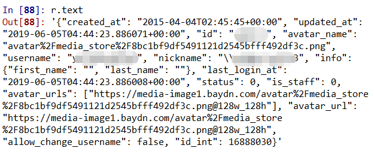

这时候，我们已经把登入的信息，保存在`s` 里面了

## 爬取炼句

## 如何获取网页接口

还是刚刚的开发模式，打开我们想要爬取的网页，然后看实际我们要获取的网页是什么？

（我们获取的网页，和显示的网页，不是同一个）

比如扇贝上面显示的是：`https://www.shanbay.com/sentence/book/all/常用/?id=10`

但实际上是：`https://www.shanbay.com/api/v1/sentence/book/phrase/10/?_=1559715369583`

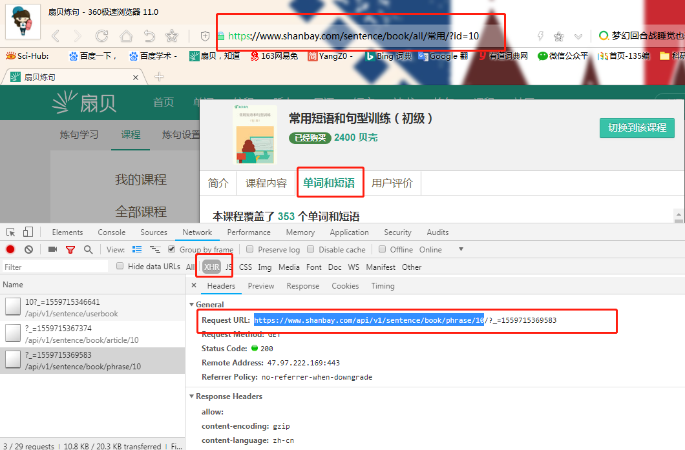

这里发现，获取方式，变成`GET`了。刚刚我们讲了`POST`，现在就换成`GET`

我们输网址的时候，后面那个`?_155.....`不需要输入，是一个时间戳

```python
url = 'https://www.shanbay.com/api/v1/sentence/book/phrase/10'
GetUrl = s.get(url)  # 这里换成get了，刚刚是s.post
TextWeb = GetUrl.text
print(TextWeb)
```

数据已经都取读了，只不过在系统储存的时候，都是编码`\u02cc\`这种，转成文字就好啦~

这里有个小技巧，可以一键转换，后来会讲

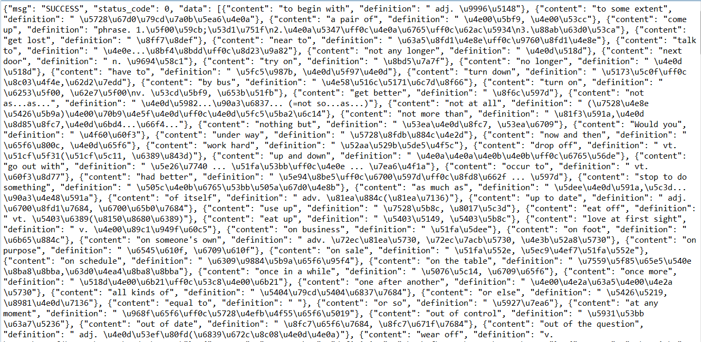

这爬出来的网页，密密麻麻，眼花缭乱，看不懂怎么办？

这时候，你可以点`Preview`，这里面就好看很多

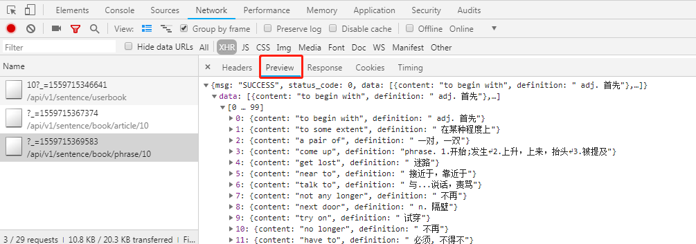

这和我们得到的数据是一致的，只是我们的数据需要转换

## 清洗数据：短语和单词

短语和单词相对简单一点，可以在网页上直接读取

（1）re.findall所有值

```Python
DataList = re.findall("{\"content.*?}",TextWeb)
```

我们通过re.findall得到的数据是有规律的，每一个短语，都相当于一个**字典**

里面包含了`content`和`definition`两部分的数据，可以一键提取哟~

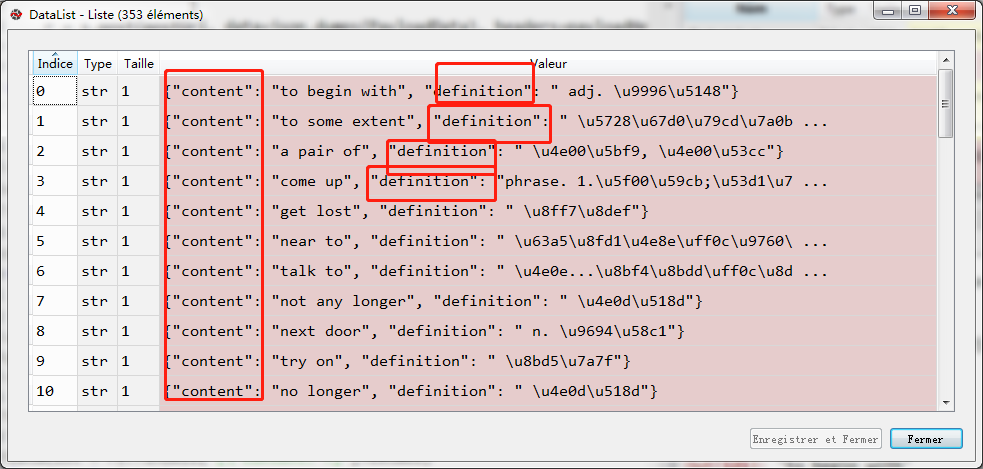


（2）把数据转成字典

大家可以看到，实际上，这时候的类型，是一个`str`字符串，我们要转化成`字典`，才方便操作

```python
phrase_dict = json.loads(phrase)  #用json.load就可以直接转换
sheet.write(j, 0, phrase_dict['content'])  #然后就可以直接提取字典内容，保存到Excel
sheet.write(j, 1, phrase_dict['definition'])
```

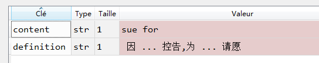

这时候提取的数据，就很完美啦~

## 清洗数据：炼句

炼句的获取，比句子和短语稍微麻烦一点

因为它最初获得的网页，是一个汇总。比如有30课炼句，它就提供了30个链接。

你需要先获取链接，然后再进入各个网页提取数据

```python
for article in article_List:
    article_dict = json.loads(article)
    article_id = article_dict['article_id']
    article_id_url = book_article_url+"/"+str(article_id)
    Text_article_id = GetTextWeb(article_id_url,s)
    
    content_article_1 = re.findall(" {\"zh-CN\": {\"content.*?}",Text_article_id)
    for content1 in content_article_1:        
        content1 = content1[len("{\"zh-CN\":")+2:]
        content_dict_1 = json.loads(content1)
        sheet.write(m, 1, content_dict_1['content'])
        m += 1
```

其实就是，来两个`for`循环。第一次确定具体链接，第二次再提取数据

另外，扇贝里面包含简体和繁体解释，大家可以自行选取。我现在是用的简体`zh-CN`

取读句子的时候，炼句还有个麻烦事

它的网页，竟然不是统一的。格式会有变化。但总体看下来，就是有2种结构

```python
    content_article_2 = re.findall("(\"audio_name.*?), \"audio_urls",Text_article_id)    
    if content_article_2 == []:
        content_article_2 = re.findall("(\"content\".*?\"),",Text_article_id)
        for i in content_article_2:
            if i[len("\"content\": \"")] == "\\":
                 content_article_2.remove(i)
        for i in content_article_2:
            if i[len("\"content\": \"")] == "\\":
                 content_article_2.remove(i)
```

所以用个`if` 判断一下，第一种情况读不出的时候，就用第二种

## 完整代码

```python
# -*- coding: utf-8 -*-
"""
Created on Sat May 25 2019

@author: YangYang
"""


import requests
import json
import re
import xlwt

def Login(account,password):
    payloadHeader = {'user-agent':'Mozilla/5.0 (Windows NT 6.1; WOW64) AppleWebKit/537.36 (KHTML, like Gecko) Chrome/69.0.3497.100 Safari/537.36',
                     'referer': "https://web.shanbay.com/web/account/login/",
                     'content-type': 'application/json'
                     }

    postUrl = 'https://apiv3.shanbay.com/bayuser/login'
    s = requests.Session()  # 为了保存登入信息

    PayloadData  = {
                     'account': account,
                     'code_2fa': "",
                     'password': password     
                    }
    r = s.post(postUrl, data=json.dumps(PayloadData), headers=payloadHeader)
    return s,r

def GetTextWeb(url,s):
    GetUrl = s.get(url)
    return GetUrl.text

# 输入账号密码登入  
account =input("请输入你的账号：")
password = input("请输入你的密码：")
s,r = Login(account,password)
print('\n') 
print("账号登入成功！")
# 打开Excel
workbook = xlwt.Workbook()  #定义workbook

# 输入网址
sentence_number = 40  #这是炼句的编号
book_url = "https://www.shanbay.com/api/v1/sentence/userbook/" + str(sentence_number)
book_phrase_url = "https://www.shanbay.com/api/v1/sentence/book/phrase/"+ str(sentence_number)
book_article_url = "https://www.shanbay.com/api/v1/sentence/book/article/"+ str(sentence_number)

# 获取炼句书的标题
# 这里有个奇怪的点，有些网页能读出来，有些不能
# 所以最后，我还是手动输入了（我技术不行啊）
#Text_book = GetTextWeb(book_url,s)
#title = re.findall("(\"title\".*?),",Text_book)
#title = "{"+title[0]+"}"  #转成字典
#title_dict = json.loads(title)
#workbook_title =  title_dict['title']+".xls"  # 给Excel表格命名
workbook_title =  "六级阅读短语训练.xls"  # 给Excel表格命名


# 获取炼句
print('\n') 
print("正在取读炼句数据，请等待……")
Text_article = GetTextWeb(book_article_url,s)
article_List = re.findall("{\"status.*?}",Text_article)

sheet = workbook.add_sheet('课程内容')  #添加sheet
head = [ '内容', '解释']
for h in range(len(head)):
    sheet.write(0, h, head[h])    #把表头写到Excel里面去
m = 1 #Excel开始写入的位置  
n = 1 #Excel开始写入的位置  
for article in article_List:
    article_dict = json.loads(article)
    article_id = article_dict['article_id']
    article_id_url = book_article_url+"/"+str(article_id)
    Text_article_id = GetTextWeb(article_id_url,s)
    
    content_article_1 = re.findall(" {\"zh-CN\": {\"content.*?}",Text_article_id)
    for content1 in content_article_1:        
        content1 = content1[len("{\"zh-CN\":")+2:]
        content_dict_1 = json.loads(content1)
        sheet.write(m, 1, content_dict_1['content'])
        m += 1
        
    content_article_2 = re.findall("(\"audio_name.*?), \"audio_urls",Text_article_id)    
    if content_article_2 == []:
        content_article_2 = re.findall("(\"content\".*?\"),",Text_article_id)
        for i in content_article_2:
            if i[len("\"content\": \"")] == "\\":
                 content_article_2.remove(i)
        for i in content_article_2:
            if i[len("\"content\": \"")] == "\\":
                 content_article_2.remove(i)
    for content2 in content_article_2:
        content2 = "{"+content2+"}"  #转成字典
        content_dict_2 = json.loads(content2)
        sheet.write(n, 0, content_dict_2['content'])    
        n += 1
        
    
# 获取单词和短语
print('\n') 
print("正在取读单词和短语数据，请等待……")    
Text_phrase = GetTextWeb(book_phrase_url,s)
phrase_List = re.findall("{\"content.*?}",Text_phrase)

sheet = workbook.add_sheet('单词和短语')  #添加sheet
head = [ '内容', '解释']
for h in range(len(head)):
    sheet.write(0, h, head[h])    #把表头写到Excel里面去
j = 1 #Excel开始写入的位置  

for phrase in phrase_List:
    phrase_dict = json.loads(phrase)
    sheet.write(j, 0, phrase_dict['content'])
    sheet.write(j, 1, phrase_dict['definition'])
    j += 1

  
workbook.save(workbook_title)
print('\n') 
print('写入excel成功')
print("文件位置：和代码在同一个文件夹")
print('\n') 
input("炼句取读完毕，点击回车退出")

```


## 最后补充：爬取个人单词书

方式和炼句是完全一致的，就是网址不同

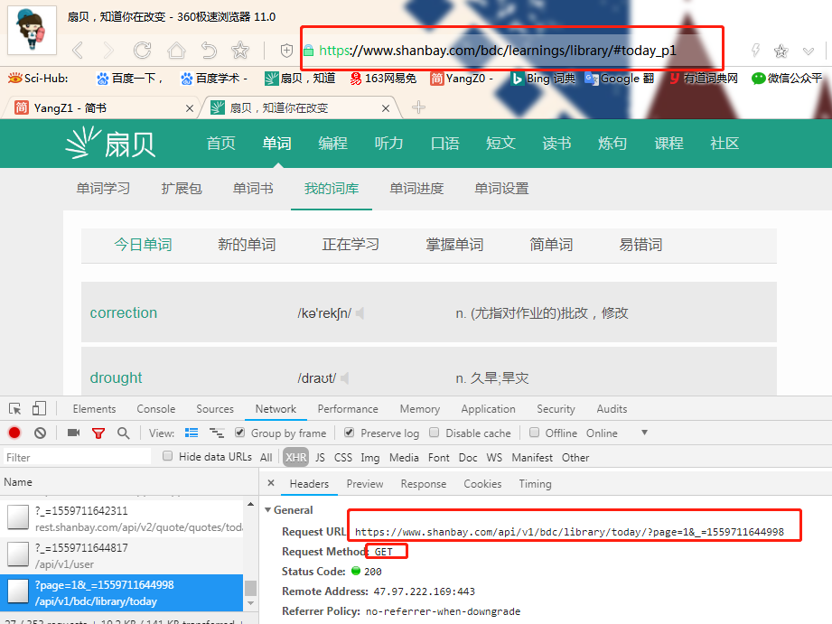

网址后面有一个`&_=1559700584497`，这个是个时间戳（写代码的时候可以不加，也能获取数据）

```python
url = 'https://www.shanbay.com/api/v1/bdc/library/today/?page=1'
word = s.get(url)  # 这里换成get了，刚刚是s.post
print(word.text)
```

这时候就能看到对应单词的拼写、发音、解释等等

比如anecdotal，它的数据，和网页显示一致

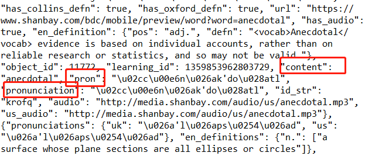

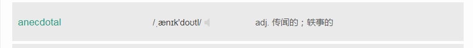

同样，系统储存的时候，都是编码`\u02cc\`这种，转成文字就好啦~

你可以点`Preview`，一个单词，里面有发音、中英文解释、例句等等

你需要哪些，就获取哪些

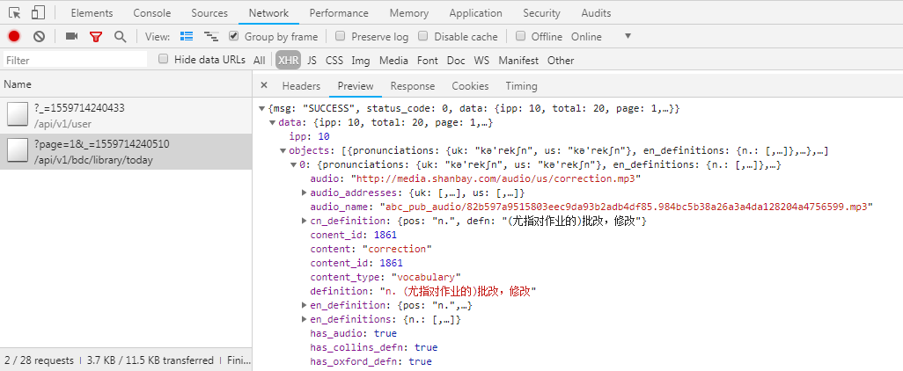

具体数据清洗，这里不废话了，之前操作都讲过啦~


## 附：参考网页

爬虫（抓取静态页面和动态页面的区别，get请求和post请求的区别）：<https://blog.csdn.net/Spencer_q/article/details/82631154>

扇贝自动打卡Python脚本（Python3）

https://www.jianshu.com/p/284499d5e8b5

如何查看接口？

https://blog.csdn.net/meiceatcsdn/article/details/79999439

python爬虫如何POST request payload形式的请求

https://blog.csdn.net/zwq912318834/article/details/79930423